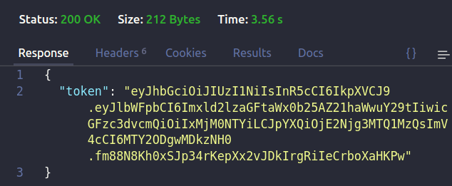

 <h1 align="center">
  🔐 Back-end JWT Auth
</h1>



---

# Indice

- 👨‍💻️ [Tecnogias utilizadas](#%EF%B8%8F-tecnogias-utilizadas)
- 📦️ [Como baixar o projeto](#%EF%B8%8F-como-baixar-o-projeto)
- 🚀 [Como rodar o projeto](#-como-rodar-o-projeto)

---

## 👨‍💻️ Tecnogias utilizadas

O projeto foi desenvolvido utilizando as seguintes tecnologias:

- [Node.js](https://nodejs.org/)
- [TypeScript](https://www.typescriptlang.org/)
- [Joi](https://joi.dev/)

### Banco de Dados
  - 🐬 [MySQL](https://www.postgresql.org/)
  - 🐋 [Docker](https://www.docker.com/)

### IDE

  - [Visual Studio Code](https://code.visualstudio.com/)

---

## 📦️ Como baixar o projeto

Para copiar o projeto, utilize os comandos:

```bash
  # Clonar o repositório
  ❯ git clone git@github.com:vschagas/Jwt-Auth.git

  # Entrar no diretório
  ❯ cd Jwt-Auth
```
Para instalar as dependências e iniciar o projeto, você pode utilizar o Yarn ou NPM:

**Utilizando yarn**

```bash
  # Instalar as dependências
  ❯ yarn
```

**Utilizando npm**

*PS: Caso utilize o NPM, apaque o arquivo `yarn.lock` para ter todas as dependências instaladas da melhor forma.*

```bash
  # Instalar as dependências
  ❯ npm install
```

---

## 🚀 Como rodar o projeto 

Para criar o container docker do banco postgres

```bash
  docker-compose up --build -d
```

Para rodar o projeto

```bash
  npm run dev
```